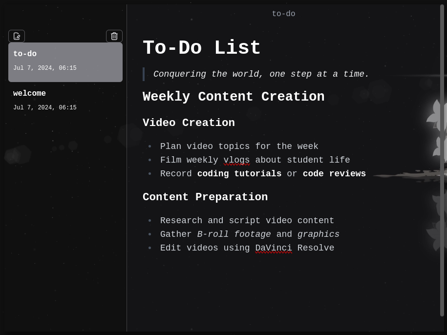

# 📝 Brezel-Notes App



A sleek, modern notes app built with TypeScript, TailwindCSS, and ElectronJS. Supports Markdown and integrates seamlessly with the filesystem for creating, reading, updating, and deleting notes. Containerized with Docker for easy deployment.

## ✨ Features

- **Markdown support**: Write and render notes with full Markdown support.
- **Filesystem integration**: Perform CRUD operations directly on your filesystem.
- **Cross-Platform**: Built with ElectronJS to run on Windows, macOS, and Linux.
- **TypeScript**: Enjoy the benefits of a statically-typed language.
- **TailwindCSS**: Beautiful, responsive UI out of the box.
- **Dockerized**: Easy to build and run anywhere with Docker.

## 🚀 Getting Started

### Prerequisites

- [Docker](https://www.docker.com/get-started)
- [Git](https://git-scm.com/downloads)

### Installation

1. Clone the repository:

```bash
git clone git@github.com:salgue441/Markdown-Notes.git
cd Markdown-Notes
```

2. Run the app with docker. Use the provided shell script:

```bash
sudo chmod +x run_docker.sh
./run_docker.sh
```
